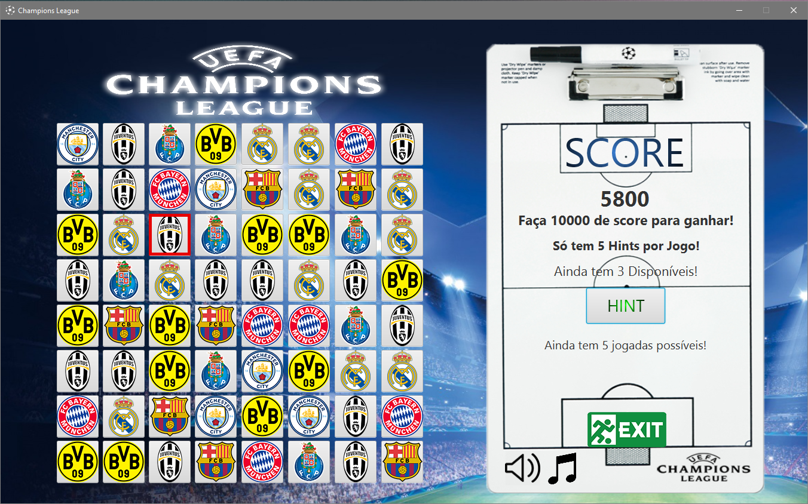

# Java-Game-OOP-with-Interface-Design (JavaFX)
**A CandyCrush type game with Java OOP and Interface Design (JavaFX) with Soccer as a theme.**

---

Java OOP and Interface Design, where the theme is Soccer and has music and movement effects.

There are 3 .png files in the main folder with screenshots of the actual game running, with some different moments of the gameplay.

---

Made by Pedro Gomes, 2017/2018

